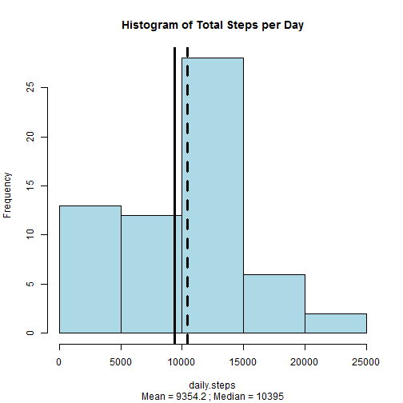
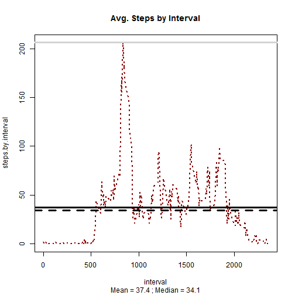
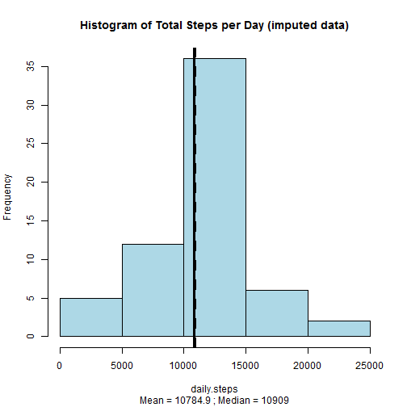

# Reproducible Research: Peer Assessment 1   

### Author: Armin Kakas   

#### Date: Saturday, December 13, 2014   


## Problem Statement

I will evaluate the **Activity monitoring data** dataset, obtained from the course website. Along with imputing missing values, I will attempt to analyze the data, and answer the following questions:  

* What is mean total number of steps taken per day?

* What is the average daily activity pattern?

* Are there differences in activity patterns between weekdays and weekends?


### The Base Data Set

The variables included in this dataset are:  

* steps: Number of steps taking in a 5-minute interval (missing values are coded as NA)  

* date: The date on which the measurement was taken in YYYY-MM-DD format  

* interval: Identifier for the 5-minute interval in which measurement was taken  

* The dataset is stored in a comma-separated-value (CSV) file and there are a total of 17,568 observations in this dataset.  


## LOADING AND MODIFYING DATA TO PREPARE FOR ANALYSIS
In this section, I read in the "csv" file, converting into a **data.table** for easier and faster data manipulation. I accomplish this by first downloading the compressed file from the URL provided, and naming it **temp.zip**. Next, I unzip this file, and read in the contents as a "csv" file.

Please note that I converted the **date** field into R's date format. I have also created additional date variables, including weekday/weekend indicators, for potential analysis later:  
- for the **month** field, 0=January  
- for **day of week** field, 0=Sunday  


```r
library(car)
library(data.table)
library(doBy)
library(ggplot2)
library(MASS)
library(plyr)
library(reshape)
library(reshape2)
library(scales)
library(effects)
library(corrplot)
library(knitr)
library(xtable)
library(downloader)
library(curl)

        #downloading compressed file, unzipping it and reading in .csv file

setwd("~/GitHub/RepData_PeerAssessment1")

download.file("http://d396qusza40orc.cloudfront.net/repdata%2Fdata%2Factivity.zip", destfile = "temp.zip")

data <- data.table(read.csv(unzip("temp.zip")))

        #converting the "date" field into R's date format
data$date <- as.Date(data$date) 

        #creating additional date variables, including weekday/weekend indicator, for potential analysis later
        #for "month" field, 0=January
        #for "day of week" field, 0=Sunday
data2 <- data[, c("day.of.month","month","year", "day.of.week") := 
                  list(as.POSIXlt(date)$mday, as.POSIXlt(date)$mon, as.POSIXlt(date)$year+1900, 
                   as.POSIXlt(date)$wday)][, type.of.day := 
                                               ifelse(day.of.week == 0 | day.of.week == 6, 
                                                      "weekend","weekday")] 

        #first few lines of the original (unimputed) data
head(data2)
```

```
##    steps       date interval day.of.month month year day.of.week
## 1:    NA 2012-10-01        0            1     9 2012           1
## 2:    NA 2012-10-01        5            1     9 2012           1
## 3:    NA 2012-10-01       10            1     9 2012           1
## 4:    NA 2012-10-01       15            1     9 2012           1
## 5:    NA 2012-10-01       20            1     9 2012           1
## 6:    NA 2012-10-01       25            1     9 2012           1
##    type.of.day
## 1:     weekday
## 2:     weekday
## 3:     weekday
## 4:     weekday
## 5:     weekday
## 6:     weekday
```


## WHAT IS THE TOTAL NUMBER OF STEPS TAKEN PER DAY?

Please see below a **histogram** of the total number of steps taken ech day. Note that the **dashed** vertical line represents the **median** value, and the **solid** vertical line represents the **mean** value of the steps per day.


```r
steps.per.day <- data2[, sum(steps, na.rm = TRUE), by = date]
setnames(steps.per.day, "V1","daily.steps")

mean.steps <- mean(steps.per.day$daily.steps)
median.steps <- median(steps.per.day$daily.steps)

with(steps.per.day, hist(daily.steps, col = "lightblue", freq = TRUE, main = ""))
title(main = "Histogram of Total Steps per Day", 
      sub = paste0("Mean = ", round(mean.steps,1), " ; Median = ", round(median.steps,1)))
abline(v = median.steps, col = "black", lwd = 3, lty = "dashed")
abline(v = mean.steps , col = "black", lwd = 3, lty = "solid")
```

 

#### The mean and median total number of steps taken per day are **9354.2295082** and **10395**, respectively.  


## WHAT IS THE AVERAGE DAILY ACTIVITY PATTERN?

Please see a visualization of the 5-minute interval (x-axis) and the average number of steps taken, averaged across all days (y-axis). Similar to the prior visuals, the  **dashed** horizontal line represents the **median** value, and the **solid** vertical line represents the **mean** value of the steps per interval.   
Additionally, the **grey solid** horizontal line represents the top interval with the maximum number of steps.  

Below, you will also see the top interval that contains the maximum number of steps **(occuring between 8:35am-8:40am)**.  


```r
steps.per.interval <- data2[, mean(steps, na.rm = TRUE), by = interval]
setnames(steps.per.interval, "V1","steps.by.interval")

mean.interval <- mean(steps.per.interval$steps.by.interval)
median.interval <- median(steps.per.interval$steps.by.interval)

with(steps.per.interval, plot(steps.by.interval ~ interval, type = "l", col = "darkred", lwd = 2, lty = 3))
title(main = "Avg. Steps by Interval", 
      sub = paste0("Mean = ", round(mean.interval,1), " ; Median = ", round(median.interval,1)))
abline(h = median.interval, col = "black", lwd = 3, lty = "dashed")
abline(h = mean.interval , col = "black", lwd = 3, lty = "solid")
abline(h = max(steps.per.interval$steps.by.interval), lwd = 3, lty = "solid", col = "lightgrey")
```

 

```r
    #Top Interval
steps.per.interval[order(steps.per.interval$steps.by.interval, decreasing  = TRUE)][1]  
```

```
##    interval steps.by.interval
## 1:      835          206.1698
```


## IMPUTING MISSING VALUES

In this section, I will fill in missing values with the **average** values of each interval, and create a new data set called **imputed.data** that is equal to the original dataset, but with the missing data filled in.    

The total number of missing values in the dataset was originally **2304**.   


```r
data.corrections <- data.table(merge(data2, 
                                 steps.per.interval, by = "interval", 
                                 all.x = TRUE))[, imputed.steps := ifelse(is.na(steps) >0, 
                                                                          ceiling(steps.by.interval), steps)]
data.corrections$steps <- NULL
setnames(data.corrections, "imputed.steps","steps")

imputed.data <- subset(data.corrections, select = c("steps","date","interval","day.of.month","month",
                                                    "year","day.of.week","type.of.day"))
```

### WHAT IS THE TOTAL NUMBER OF STEPS TAKEN EACH DAY WITH THE IMPUTED DATA?

Please see a histogram of the total number of steps taken each day based on the imputed data. Note that the **dashed** vertical line represents the **median** value, and the **solid** vertical line represents the **mean** value of the steps per day. Below, I have also created a table that summarizes the key differences between the **original** vs. **imputed** data set.   

As you can see, both the mean and median imputed values are higher than the original. Furthermore, the median and mean imputed values are quite close to each other.  


```r
steps.per.day.imputed <- imputed.data [, sum(steps), by = date]
setnames(steps.per.day.imputed, "V1","daily.steps")

mean.steps.imputed <- mean(steps.per.day.imputed$daily.steps)
median.steps.imputed <- median(steps.per.day.imputed$daily.steps)

with(steps.per.day.imputed, hist(daily.steps, col = "lightblue", freq = TRUE, main = ""))
title(main = "Histogram of Total Steps per Day (imputed data)", 
      sub = paste0("Mean = ", round(mean.steps.imputed,1), " ; Median = ", round(median.steps.imputed,1)))
abline(v = median.steps.imputed, col = "black", lwd = 3, lty = "dashed")
abline(v = mean.steps.imputed , col = "black", lwd = 3, lty = "solid")
```

 

```r
x <- data.frame(cbind(mean = round(mean.steps), mean.imputed = round(mean.steps.imputed), 
                      median = round(median.steps), median.imputed = round(median.steps.imputed)))

table <- xtable(x)
print(table, type = "html")
```

<!-- html table generated in R 3.1.2 by xtable 1.7-4 package -->
<!-- Sat Dec 13 11:39:39 2014 -->
<table border=1>
<tr> <th>  </th> <th> mean </th> <th> mean.imputed </th> <th> median </th> <th> median.imputed </th>  </tr>
  <tr> <td align="right"> 1 </td> <td align="right"> 9354.00 </td> <td align="right"> 10785.00 </td> <td align="right"> 10395.00 </td> <td align="right"> 10909.00 </td> </tr>
   </table>


